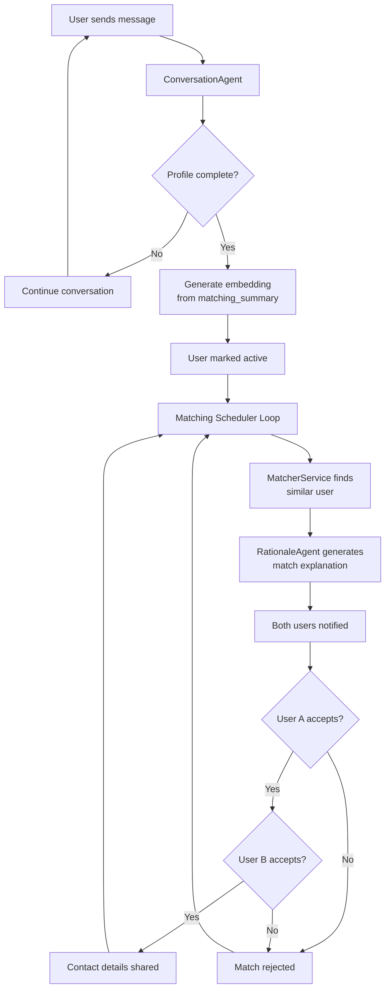
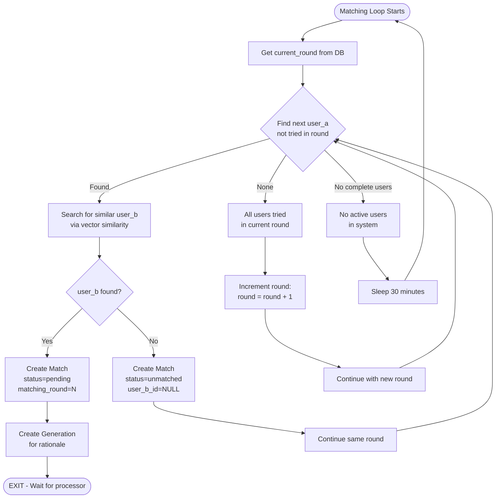
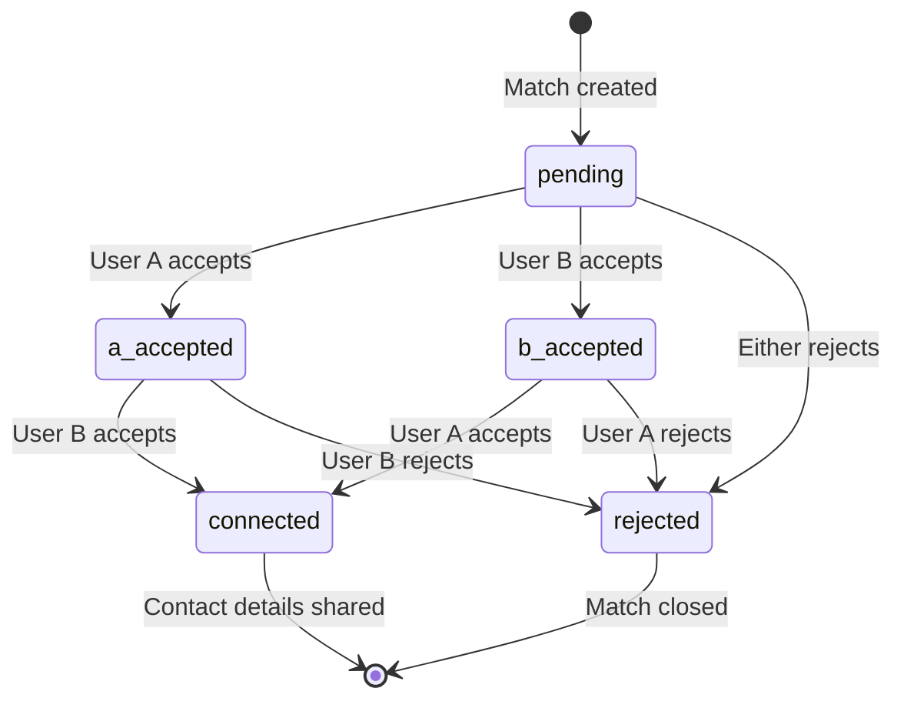
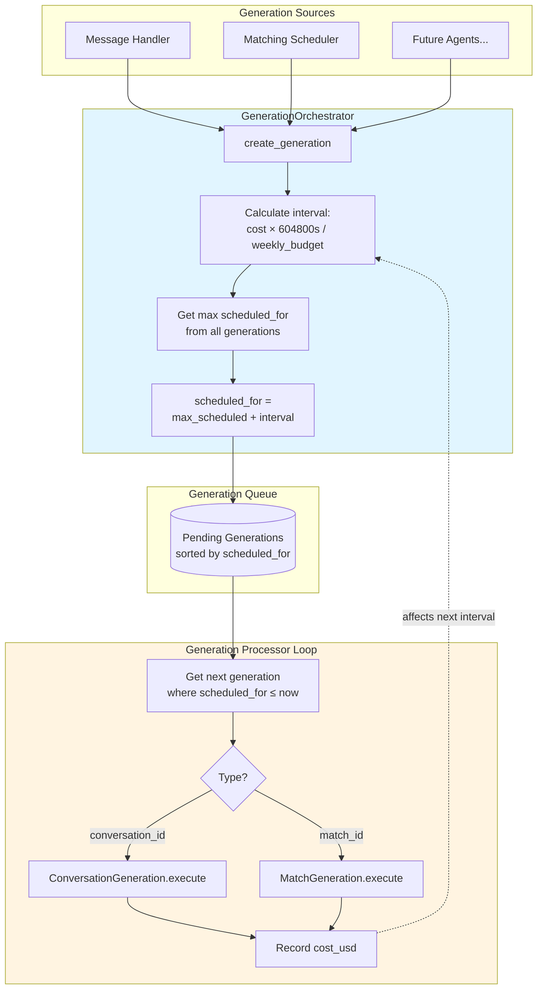
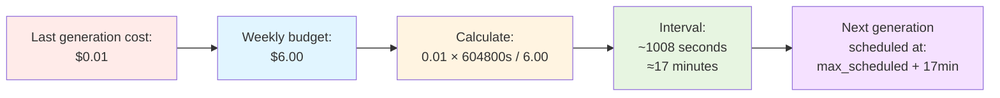

# Mitko: IT Matchmaker Telegram Bot

An LLM-powered Telegram bot that helps match IT job seekers with employers/contractors through natural conversation.

## Usage

1. Users start a conversation with `/start`
2. Bot asks questions to understand their profile (seeker vs provider)
3. Once profile is complete, bot stores it with vector embeddings
4. Background matching continuously finds matches using:
   - Round-robin fairness (all users tried before retries)
   - Vector similarity search (pgvector cosine distance)
   - Immediate continuation when matches found or rounds exhausted
5. Both parties are notified and can accept/reject
6. When both accept, contact details are shared

## Features

- Natural freeform conversation to understand user profiles
- Unified conversational agent handles both chat and profile extraction/updates
- Organic profile creation - agent decides when it has enough information
- Conversational profile updates (e.g., "change my location to Berlin")
- Automatic profile extraction with vector embeddings
- Smart matching using similarity search (pgvector)
- Mutual consent flow for connections
- Configurable LLM providers (OpenAI/Anthropic)
- Type-safe structured outputs via PydanticAI and Pydantic models
- Multi-language support (EN/RU) with type-safe i18n

## Architecture Diagrams

### Overall System Flow

High-level flow from user interaction through profile creation, matching, and contact sharing.



### Round-Robin Matching Scheduler

Shows the three possible outcomes in each iteration of the matching loop - the trickiest part of the system.



### Match Status State Machine

Shows all possible state transitions during mutual consent flow.



### Generation Orchestration

Shows how GenerationOrchestrator manages all types of LLM generations with budget control - a universal queueing system.



### Budget Control Formula

Shows the dynamic spacing calculation in detail.



## Architecture

- **FastAPI** - Web framework for webhook handling
- **aiogram v3** - Async Telegram bot framework
- **SQLModel** - Pydantic-powered async ORM (built on SQLAlchemy 2.0)
- **PydanticAI** - Type-safe LLM agent framework with structured outputs
- **Neon PostgreSQL + pgvector** - Database with vector similarity search
- **APScheduler** - Background job scheduling for matching

## Setup

1. Install dependencies:
```bash
uv sync
# or
pip install -e .
```

2. Set up environment variables:
```bash
cp .env.example .env
# Edit .env with your credentials
```

3. Set up database with pgvector extension:
```sql
CREATE EXTENSION IF NOT EXISTS vector;
```

4. Run migrations:
```bash
alembic upgrade head
```

5. Start the bot:
```bash
uvicorn src.mitko.main:app --reload --host 0.0.0.0 --port 8000
```

6. Set webhook URL (replace with your domain):
```bash
curl -X POST "https://api.telegram.org/bot<YOUR_BOT_TOKEN>/setWebhook?url=https://your-domain.com/webhook/your_secret"
```

## Environment Variables

- `DATABASE_URL` - PostgreSQL connection string (postgresql+asyncpg://...)
- `TELEGRAM_BOT_TOKEN` - Telegram bot token from @BotFather
- `TELEGRAM_WEBHOOK_SECRET` - Secret for webhook validation
- `TELEGRAM_WEBHOOK_URL` - Full webhook URL (optional, for auto-setup)
- `LLM_PROVIDER` - `openai` or `anthropic` (default: `openai`)
- `OPENAI_API_KEY` - OpenAI API key (required if using OpenAI)
- `ANTHROPIC_API_KEY` - Anthropic API key (required if using Anthropic)
- `MITKO_LANGUAGE` - Language for bot responses: `en` or `ru` (default: `en`)
- `MATCHING_INTERVAL_MINUTES` - How often to run matching (default: 30)
- `SIMILARITY_THRESHOLD` - Minimum similarity score for matches (default: 0.7)
- `MAX_MATCHES_PER_PROFILE` - Max matches per profile per run (default: 5)
- `WEEKLY_BUDGET_USD` - Target weekly LLM spending in USD (default: 6.0). See Budget Control section below.

## Budget Control

The bot uses dynamic cost-based scheduling to stay within a weekly LLM budget. When a user sends a message, the system calculates how long to wait before processing it based on the cost of the previous generation.

**How it works**:
- The interval between generations is proportional to the last generation's cost
- Formula: if the last generation cost X dollars, wait `(X / weekly_budget) * 1 week` before the next one
- Example: With a $6/week budget, a $0.01 generation schedules the next one ~17 minutes later
- The system self-adjusts: expensive conversations (long chat histories) automatically increase spacing
- First generation always runs immediately since there's no cost history yet

This ensures spending stays roughly constant week-to-week regardless of conversation complexity. Currently applies to the conversation agent; rationale agent integration planned once APIs are unified.

## Development

The project uses:
- Type hints throughout
- Async/await for all I/O operations
- SQLModel (Pydantic + SQLAlchemy 2.0) async patterns
- PydanticAI for type-safe LLM agent outputs
- Pydantic models for validation and structured data
- Single unified ConversationAgent for natural conversation and profile management
- Type-safe i18n with nested dataclasses for full IDE autocomplete

