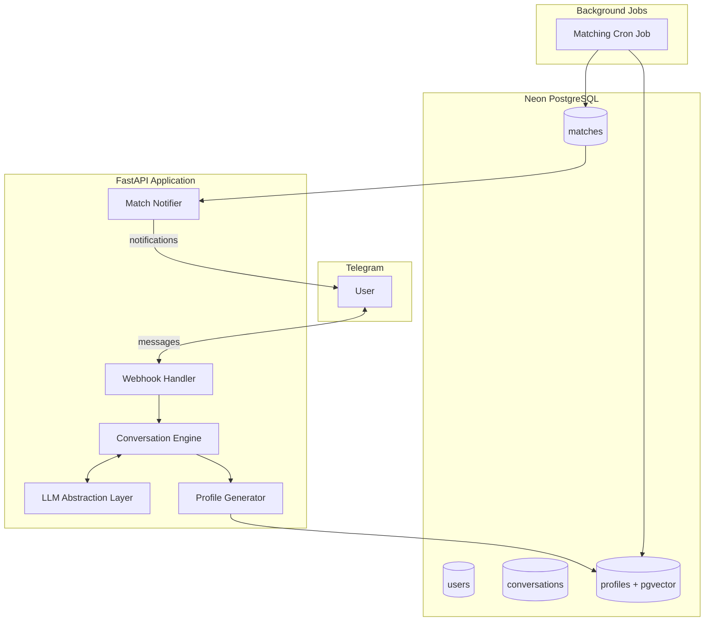
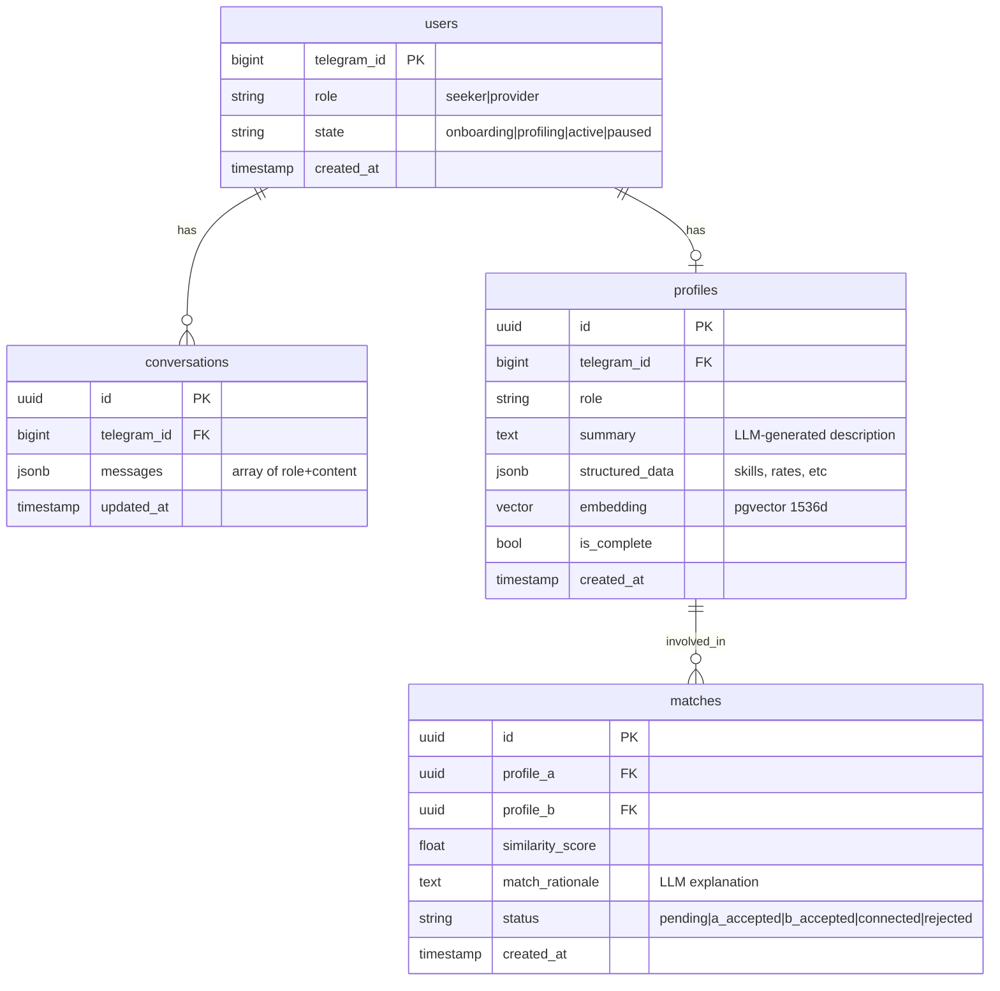

# Mitko: IT Matchmaker Telegram Bot

## Architecture Overview



## Project Structure

```
mitko/
├── pyproject.toml              # Dependencies (poetry/uv)
├── alembic/                    # DB migrations
│   └── versions/
├── src/
│   └── mitko/
│       ├── __init__.py
│       ├── main.py             # FastAPI app + webhook
│       ├── config.py           # Settings via pydantic-settings
│       ├── models/             # SQLAlchemy models
│       │   ├── __init__.py
│       │   ├── user.py
│       │   ├── conversation.py
│       │   ├── profile.py
│       │   └── match.py
│       ├── llm/                # LLM abstraction layer
│       │   ├── __init__.py
│       │   ├── base.py         # Abstract base class
│       │   ├── openai.py
│       │   ├── anthropic.py
│       │   └── embeddings.py   # Embedding generation
│       ├── bot/                # Telegram bot logic
│       │   ├── __init__.py
│       │   ├── handlers.py     # Message handlers
│       │   ├── keyboards.py    # Inline keyboards
│       │   └── conversation.py # Conversation state machine
│       ├── services/           # Business logic
│       │   ├── __init__.py
│       │   ├── profiler.py     # Profile extraction
│       │   └── matcher.py      # Matching engine
│       └── jobs/               # Background tasks
│           ├── __init__.py
│           └── matching.py     # Cron job for matching
├── tests/
└── README.md
```

## Database Schema



## Key Implementation Details

### 1. LLM Abstraction Layer

A simple protocol-based abstraction to swap providers:

```python
from typing import Protocol

class LLMProvider(Protocol):
    async def chat(self, messages: list[dict], system: str) -> str: ...
    async def embed(self, text: str) -> list[float]: ...
```

- OpenAI: `gpt-4o-mini` for chat, `text-embedding-3-small` for vectors
- Anthropic: `claude-3-5-sonnet` for chat, use OpenAI for embeddings (Anthropic has none)
- Config-driven provider selection via environment variables

### 2. Conversation Flow

The bot uses a system prompt that instructs the LLM to:

1. Determine user role (seeker vs provider) early
2. Ask relevant questions based on role
3. Extract structured info while maintaining natural conversation
4. Signal when profile is "complete enough" via a special token/JSON

State machine states:

- `onboarding` - initial role selection
- `profiling` - gathering information
- `active` - profile complete, eligible for matching
- `paused` - user opted out temporarily

### 3. Profile Generation

Once the LLM signals completion:

1. Generate a structured summary from conversation history
2. Extract structured fields (skills, experience, budget/rates, location, etc.)
3. Generate embedding vector from the summary
4. Store in `profiles` table with pgvector

### 4. Matching Engine (Cron Job)

Runs periodically (every N minutes):

1. Find all `active` profiles that haven't been matched recently
2. For each seeker, find top-K similar providers via cosine similarity:
   ```sql
   SELECT p2.*, 1 - (p1.embedding <=> p2.embedding) as similarity
   FROM profiles p1, profiles p2
   WHERE p1.role = 'seeker' AND p2.role = 'provider'
   AND similarity > 0.7
   ORDER BY similarity DESC LIMIT 5;
   ```

3. Filter out already-matched pairs
4. Create `match` records with status `pending`
5. Send notifications to both parties with match rationale

### 5. Match Consent Flow

When notified of a match:

- User sees: "Found a potential match! [View Details]"
- Details show the *other* profile summary (not contact info)
- Buttons: "Yes, connect me" / "Not interested"
- When both accept → status becomes `connected`, share contact details
- If either rejects → status becomes `rejected`

## Tech Stack Summary

| Component | Choice |

|-----------|--------|

| Framework | FastAPI + Uvicorn |

| Telegram | aiogram v3 (async-native) |

| Database | Neon PostgreSQL + pgvector |

| ORM | SQLAlchemy 2.0 (async) |

| Migrations | Alembic |

| LLM | OpenAI / Anthropic (configurable) |

| Embeddings | OpenAI text-embedding-3-small |

| Config | pydantic-settings |

| Jobs | APScheduler (in-process) or external cron |

| Packaging | uv (fast, modern) |

## Implementation Order

The work is structured in phases, each delivering a working increment:

**Phase 1: Foundation** - Project setup, database models, basic bot responding

**Phase 2: Conversation Engine** - LLM integration, conversation state, profile extraction

**Phase 3: Matching** - Embeddings, similarity search, match creation

**Phase 4: Connection Flow** - Notifications, consent handling, contact sharing

**Phase 5: Polish** - Error handling, rate limiting, monitoring, deployment config